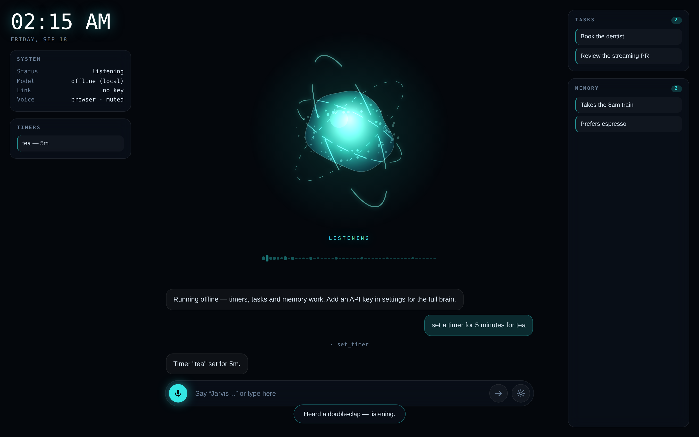
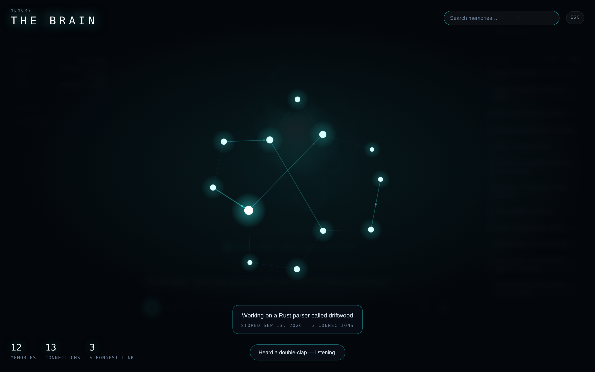
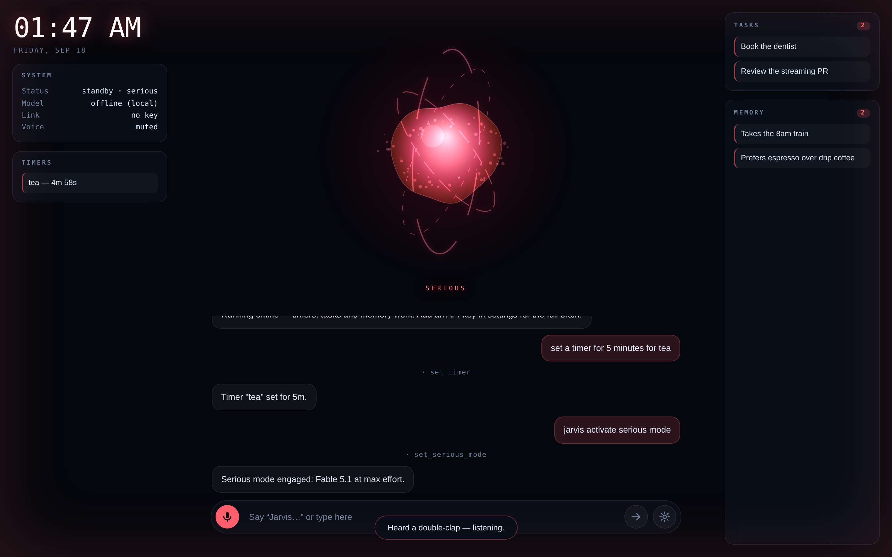
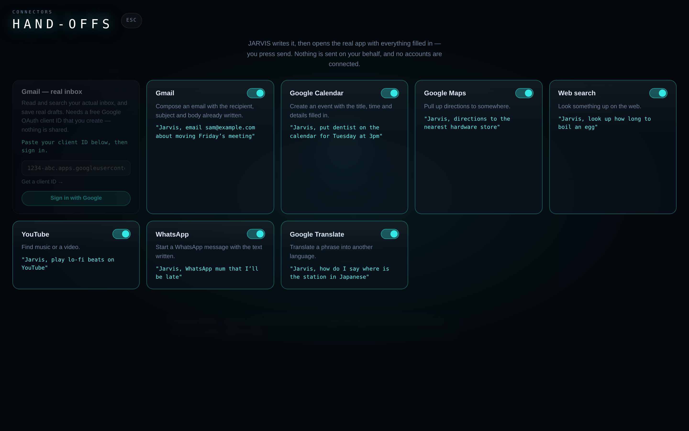

# JARVIS

A voice-first AI assistant that runs in the browser. Say the wake word, talk to it,
and it talks back — with a reactive orb, a persistent memory of you, and tools it
can actually run.



## What it does

- **The memory brain.** Everything JARVIS remembers is a neuron in a living graph:
  memories that share meaning are wired together with bright synapses, signals pulse
  along them, and memories stored around the same time are threaded by faint temporal
  links. Hover any neuron to read the memory it holds; search to light up a subset.
  Open it from the Memory panel or just press **B**.
- **Installs as a real app in one click.** Visit the hosted site, press Install, done —
  no terminal, no npm. It gets its own dock/taskbar icon and window, works fully
  offline, and keeps the wake word and dictation that native wrappers can't.
- **Nine AI providers.** Claude, OpenAI, Gemini, Groq, OpenRouter, DeepSeek,
  Mistral, xAI, or Ollama on your own machine — each with its own key, in settings.
- **Three kinds of brain, two of them free.** Pick in settings:
  - **Cloud AI** — any of the providers above, using that provider's key.
  - **Local AI** — a real language model running *in your browser* on WebGPU. No key,
    no account, no cost; one download, then it works offline. Much smaller than Claude,
    but it genuinely converses and drives the tools.
  - **Offline rules** — the built-in pattern matcher. Instant, no download, handles
    timers, tasks, memory, the clock and colours.

  With no key at all JARVIS still starts and works; it never dead-ends on a missing key.
- **Voice that works in any browser.** Dictation runs through a pluggable recognizer:
  the browser's built-in engine (Chrome/Edge, most accurate) or an **on-device WASM
  engine** that captures the raw microphone — the way a game's voice chat does — and
  transcribes it locally, offline, in any browser, with no key. Pick it in settings.
- **A live voice spectrum.** A row of bars under the orb shows your raw audio while you
  talk and JARVIS's own speech while it answers — you can see the mic is live.
- **Wake word.** It listens continuously for "jarvis", captures what you say next, and
  sends it once you stop talking. No button, no push-to-talk (though Space works too).
- **Double-clap to talk.** Two claps anywhere in the room start a capture, so you don't
  even need the wake word. Toggle it in settings.
- **Speaks while it thinks.** Replies are streamed from the Messages API and spoken
  sentence-by-sentence as they arrive, so the first words land while the rest is still
  being written.
- **Barge-in.** Talk over it — "stop", "cancel", or the wake word — and it shuts up
  mid-sentence and aborts the request.
- **Pick your model and effort.** Fable 5.1, Opus 5, Sonnet 5 or Haiku 4.5, each at the
  effort level it supports, from the settings panel.
- **Serious mode.** Say *"Jarvis, activate serious mode"* and it jumps to the strongest
  model at maximum effort, turns red, and stays there until you tell it to stand down —
  for the hard, high-stakes questions.
- **Remembers you.** It decides on its own when something about you is worth keeping,
  and those facts are fed back into every later conversation. They live in
  `localStorage`, so they stay on your machine.
- **Runs tools.** Timers, a task board, memory search, recolouring itself, opening
  links, reading local device status, and the clock.
- **Connectors.** JARVIS writes the email, the calendar event, the message or the
  search and opens the real app with everything filled in — you press send. Gmail,
  Google Calendar, Maps, Web search, YouTube, WhatsApp and Translate, each toggleable
  on the Connectors page. Available to all three brains.
- **The orb reacts.** It's driven by the real microphone level through a WebAudio
  analyser while you speak, and by speech boundaries while it answers. Its colour and
  motion follow the state machine: standby, listening, thinking, speaking, serious.





## Running it

Three ways, easiest first: install it from the hosted site, open the single
file, or run the local server.

### As an installed app (easiest — no terminal)

JARVIS is published to GitHub Pages by the workflow in
`.github/workflows/pages.yml`. Once Pages is enabled on the repo (Settings →
Pages → Source: **GitHub Actions**, a one-time click), the app lives at:

**<https://leonistuff67-commits.github.io/claude-first-pr/>**

Open that in Chrome or Edge and press **Install as an app**. That's the whole
install: no npm, no server, no terminal. It gets its own dock/taskbar icon and
window, and because the service worker caches the whole shell it opens with no
network afterwards.

A PWA is the right wrapper here rather than Electron: only a real Chrome/Edge
context gives you the wake word and dictation.

Add an API key in settings for the full model, or leave it out and run on the
offline brain.

### The one file

`jarvis.html` is the whole app — HTML, CSS and every module inlined, no server, no
install. Double-click it and hit **Initialize** — that's it. With no key it runs on the
built-in offline brain (timers, tasks, memory, the clock, colours, serious mode). When
you want the full model, open settings and paste an Anthropic API key: it lives in
`localStorage` and goes straight to the API from the browser using
`anthropic-dangerous-direct-browser-access` — fine for something on your own disk, a
bad idea on anything you share.

**Initialize** is also where JARVIS asks for the microphone — through the browser's
normal permission prompt. Allow it for the wake word and double-clap; deny it and
everything else still works.

Rebuild it after changing anything under `public/` with `npm run build`.

One caveat: Chrome only grants `SpeechRecognition` on `https://` or `localhost`, so on
a bare `file://` page the wake word may be refused (it says so if that happens).
Typing works, and replies are still spoken. For the full hands-free thing, serve it:

### The server

```bash
cd jarvis
ANTHROPIC_API_KEY=sk-ant-... npm start
# -> http://localhost:8787
```

Now it's on `localhost`, the wake word works, and the key never reaches the browser —
the server proxies the stream. Click **Initialize** (browsers require a gesture before
granting the microphone and starting speech synthesis), then say
*"Jarvis, set a ten minute timer"*.

### Environment

| Variable | Purpose |
| --- | --- |
| `ANTHROPIC_API_KEY` | Enables proxy mode. Without it the browser must supply a key. |
| `PORT` | Server port, default `8787`. |
| `ANTHROPIC_BASE_URL` | Point the proxy somewhere other than `api.anthropic.com` (used by the tests). |

## Brains

`brainKind()` in `app.js` picks the engine; all three expose the same `stream()`
contract, so the turn loop is identical whichever is driving.

The **local AI** loads [WebLLM](https://github.com/mlc-ai/web-llm) from a CDN and runs a
small instruct model (Qwen 2.5 1.5B by default) on WebGPU. Model ids are resolved
against whatever that build of WebLLM actually ships, falling back to the smallest
instruct model rather than requesting an id that may have been renamed. Small models
aren't reliable at native function calling, so tools are offered through a plain JSON
protocol in the system prompt and parsed back out — both sides are pure functions with
unit tests. If WebGPU is missing or the engine can't download, it falls back to the rule
brain and says so in the transcript rather than failing silently.

The first load downloads roughly a gigabyte of weights, cached by the browser
afterwards. It is *much* weaker than Claude — fine for chat, timers and notes, not for
hard reasoning.

**If it feels slow**, three things help, in order of impact:

1. **Settings → Local AI size → Fastest.** A 0.5 GB model is several times quicker than
   the 1 GB default on modest hardware.
2. The orb and spectrum now drop to a sixth of their frame rate while the model is
   generating — they were competing with it for the same GPU.
3. The prompt is trimmed for the local brain (8 memories instead of 40, no persona
   preamble) and replies are capped at 200 tokens, since every token is real latency.

## Real Gmail access

Beyond the deep-link hand-offs, JARVIS can read your **actual** inbox — search
it, summarise it, and save real drafts — using a Google OAuth client **you**
create. There are no shared credentials and no backend: the token lives in the
tab and is never sent anywhere but Google.

Setup, once:

1. Open [Google Cloud credentials](https://console.cloud.google.com/apis/credentials),
   create a project, and enable the **Gmail API**.
2. Create an **OAuth client ID** of type *Web application*, and add the app's URL
   (e.g. `https://leonistuff67-commits.github.io/claude-first-pr/`) as an
   authorised JavaScript origin **and** redirect URI.
3. Paste the client ID into the Gmail card on the Connectors page and sign in.

Then: *"Jarvis, anything unread from my boss?"* or *"draft a reply saying I'll be
late"*.

The scopes are deliberately narrow — `gmail.readonly` and `gmail.compose`.
**Sending is never requested**, so JARVIS physically cannot send mail on your
behalf; it drafts, you press send. The token is checked against an anti-forgery
`state` value and expires on its own.

## Android

The PWA installs as a real Android app straight from Chrome (menu → *Install
app*) — own icon, own window, offline. For a packaged `.apk`, the **Build
Android APK** workflow wraps the published PWA in a Trusted Web Activity with
Bubblewrap; run it from the Actions tab and download the artifact. For a
Play Store release you'd sign it with your own upload key and publish the
resulting `assetlinks.json`.

### Opening apps

On a phone, JARVIS can open your installed apps with the text already filled
in — Spotify, YouTube, Maps, WhatsApp, Messages, the dialler, Telegram, Gmail,
Calendar, Instagram and Keep. *"Text Dan that I'll be ten minutes late"* opens
Messages with that typed; *"play Radiohead on Spotify"* opens the app on that
search.

This uses app URL schemes (`whatsapp://`, `spotify:`, `sms:`, `tel:`), which is
ordinary app-to-app linking — no accessibility service, no screen reading, no
special permissions. Each app has a web fallback, so a missing app is never a
dead end, and nothing is ever sent or dialled automatically: the app opens
ready and you press the button.

What this deliberately is **not**: control of the device. JARVIS cannot click
around inside another app, read your screen, or drive the OS. Those need the
Android Accessibility API, which Play policy restricts to genuine accessibility
use and which is the same mechanism Android banking trojans abuse.

## Connectors

A web page cannot read your mailbox without a full Google OAuth setup — a Cloud
project, a client ID and a consent screen. Rather than pretend, connectors **hand off**:
JARVIS composes the thing and opens the real app with the fields pre-filled, and you
press send. Nothing is sent on your behalf and no account is ever connected.

Each connector contributes tool definitions, so all three brains can use them — the
rules brain routes common phrasings directly, and the local and Claude brains call them
as normal tools. Every URL builder is a pure function with tests covering escaping
(an `&` in a subject must not become a new query parameter) and malformed input.



## Speech engines

Dictation goes through `recognizer.js`, which offers two interchangeable engines:

- **Browser** — the Web Speech API's `SpeechRecognition`. Most accurate, zero setup, but
  Chrome/Edge only, and it sends audio to Google.
- **On-device** — captures the raw microphone (`getUserMedia`, exactly how game voice
  chat works) and transcribes it locally with a [Vosk](https://alphacephei.com/vosk/)
  WASM model. Works in **any** browser, fully offline after the model downloads once, no
  cloud and no key. The library loads from a CDN and the model URL is configurable in
  settings — point it at any Vosk model you host if the default is unreachable.

"Automatic" uses the browser engine when it's available and falls back to on-device.
The on-device engine is newer and less accurate than Google's, and the first use
downloads a model, so it's opt-in. Replies are spoken via `speechSynthesis` either way,
which every browser supports.

## How it fits together

| File | Responsibility |
| --- | --- |
| `jarvis.html` | The built single-file app. Generated — edit `public/`, not this. |
| `build.mjs` | Inlines everything into `jarvis.html`. |
| `server.js` | Static host, plus an SSE-streaming proxy so the API key stays server-side. |
| `public/js/app.js` | The turn loop, the HUD, serious mode, and the state machine. |
| `public/js/brain.js` | Messages API client: per-model request shaping (effort, fallbacks) and SSE parsing. |
| `public/js/offline.js` | The no-key rule brain: turns phrases into tool calls with no network. |
| `public/js/localbrain.js` | The in-browser LLM (WebLLM/WebGPU): model resolution, tool protocol, streaming. |
| `public/js/voice.js` | Wake-word/silence/barge-in logic, mic capture, and the speech queue. |
| `public/js/recognizer.js` | Pluggable transcription: the browser engine and the on-device WASM engine. |
| `public/js/clap.js` | The double-clap detector — a pure state machine, so it's unit-testable. |
| `public/js/wave.js` | The live voice spectrum bars. |
| `public/js/mind.js` | The memory brain: graph wiring (pure, tested) plus the neural renderer. |
| `public/js/connectors.js` | Deep-link hand-offs to Gmail, Calendar, Maps and friends. Pure URL builders. |
| `public/js/providers.js` | Every non-Anthropic provider: OpenAI-shape adapter, tool translation. |
| `public/js/gmail.js` | Real Gmail: OAuth flow, message parsing, draft encoding. |
| `public/js/tools.js` | Tool schemas and their browser-side handlers. |
| `public/js/memory.js` | `localStorage` state: settings, facts, tasks, conversation. |
| `public/js/orb.js` | The canvas visualizer. |
| `public/sw.js`, `public/manifest.webmanifest`, `public/icons/` | PWA shell: offline cache, install metadata, app icons. |

A turn runs as: utterance → `messages.create` (streamed) → speak the text as it
arrives → if `stop_reason` is `tool_use`, run every tool in the turn, send all the
results back in one user message, and stream again. It gives up after six rounds.

Conversation history is trimmed to the last 40 messages, and the trim always lands on
a clean user turn so a `tool_result` never ends up orphaned at the front of the
request.

Defaults are tuned for conversation rather than depth: Claude Opus 5 at `effort: "low"`,
with a 4096-token cap. Both are in the settings panel — and serious mode flips them to
the strongest model at `max` for one-off hard questions, restoring your choice when it
stands down.

### A note on "full computer access"

Serious mode makes JARVIS *think* harder; it deliberately does **not** give the web page
the ability to run commands on your machine. A browser tab that executes whatever a voice
command — or the model — decides to run is a remote-code-execution hole, so that piece was
left out on purpose. The tools it does have are the safe, browser-scoped ones above.

## Tests

```bash
npm test              # SSE parser, rule brain, clap detector, engine pick, local-brain protocol
npm run test:e2e      # served app: full turn loop in a real browser vs a mock API
npm run test:bundle   # built jarvis.html over file://: model/effort pickers + serious mode
npm run test:offline  # built jarvis.html with NO key: tools run locally, network untouched
npm run test:clap     # feeds a real two-clap WAV through the mic and checks detection
npm run test:mind     # the memory brain: neurons, synapses, hover readout, search, hotkeys
npm run test:conn     # the connectors page: listing, toggles persisting, URL shape
npm run test:providers # the provider picker: per-provider keys, models, visibility
npm run test:update   # regression: an installed app must pick up a new build
npm run test:pwa      # manifest + service worker, then boots with the server killed
npm run test:all      # everything above in sequence
```

The unit tests have no dependencies. The browser tests need Playwright (`npm install`);
set `PLAYWRIGHT_MODULE` to an absolute path if yours lives somewhere unusual. Together
they cover every transport and the two things that are easy to get wrong:

- `test:e2e` boots the real server against a mock API and checks a tool-calling turn —
  the reply, the timer panel, that the orb is painting, and that memory survives a reload.
- `test:bundle` rebuilds the single file, opens it off disk in direct mode, and checks the
  request headers, the model and effort pickers, and serious-mode escalation to `max`.
- `test:offline` opens the file with no key and proves the whole thing runs on the local
  brain — a timer and a memory command land, and nothing hits the network.
- `test:clap` synthesizes a WAV with two real claps, plays it through Chromium's fake
  microphone, and asserts the app reacts — the actual audio path, not just the math.
- `test:mind` opens the memory brain over six stored memories and checks a neuron per
  memory, that synapses were wired, that hovering reads the memory out with its date,
  and that search, Escape and the **B** shortcut behave.
- `test:pwa` checks the manifest and that the service worker activates and precaches the
  shell, then **kills the server** and confirms the app still boots — real offline install.
